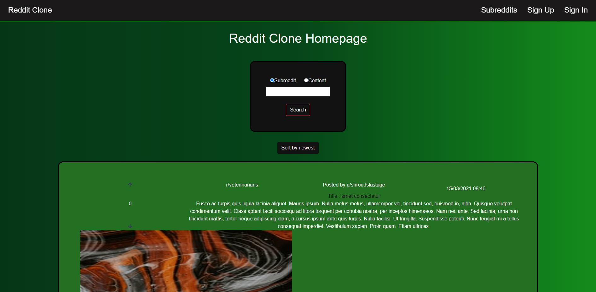

# MiniReddit

Application is a copy of a reddit. I use Socket.IO JavaScript Library, so every change is visible in real time(creating a new post, deleting post, adding a new comment, votes, etc.). To store a data, I use PostgreSQL. Guest can show posts and comments, move smoothly between each individual subreddit, sort posts by date(Desc and Asc), search posts by content or subreddit name. Logged in user has all guest privileges. He can also create/delete  posts and comments, vote for posts. Admin has all user privileges. He can also delete posts and comments created by other users.

